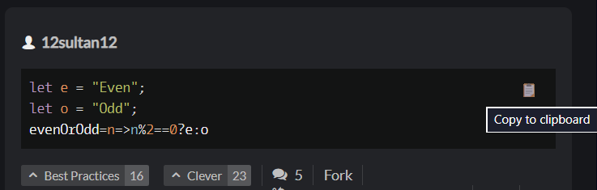
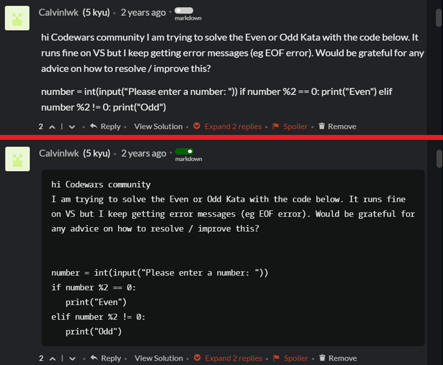
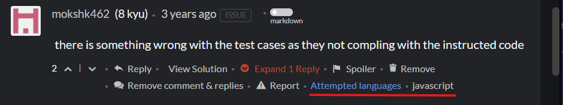
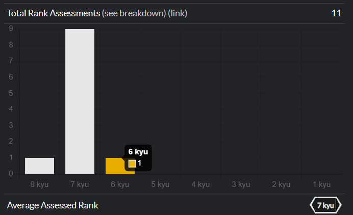
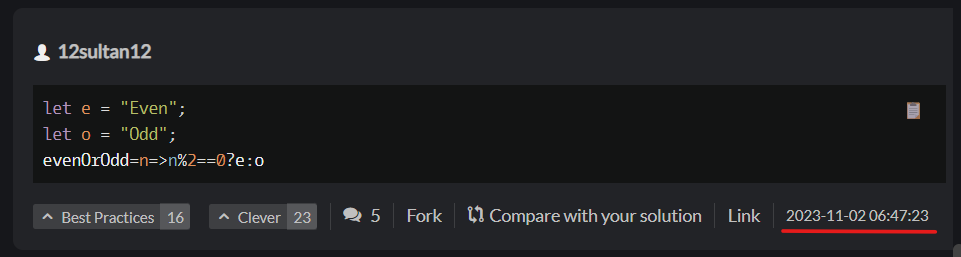
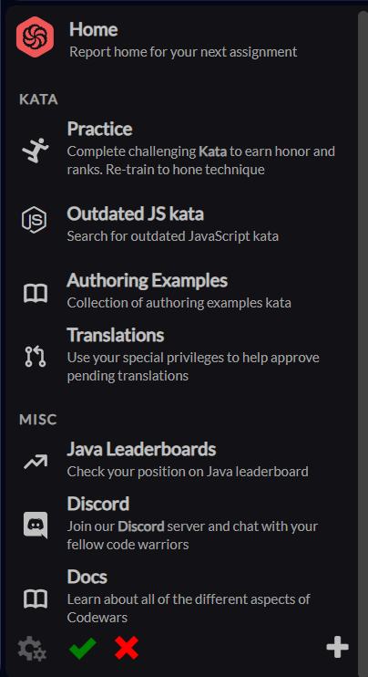
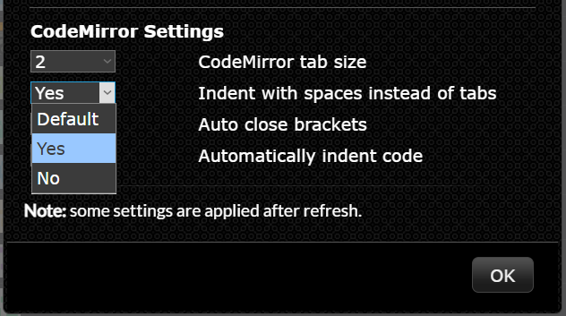

# Polyglot (Codewars userscript)

Polyglot is a Tampermonkey userscript with small, opt-in quality-of-life improvements for Codewars. It focuses on making everyday workflows faster by surfacing information that's already there, smoothing out UI friction, and adding a few "why isn't this built-in?" conveniences.

## Install

1. Install the Tampermonkey browser extension (from your browser's extension/add-ons store).
2. Download the script from the latest release: https://github.com/hobovsky/polyglot/releases/latest/download/polyglot.js
3. In Tampermonkey, create a new userscript and paste in the contents of `polyglot.js` (or import the downloaded file if your Tampermonkey/browser supports it).
4. If your browser blocks userscripts by default, check [Tampermonkey's FAQ](https://www.tampermonkey.net/faq.php) / your browser's extension settings (sometimes called "developer mode").

That's it - Tampermonkey should pick up updates automatically (depending on your Tampermonkey settings).

## Features (quick view)

Click a feature to jump to details + a screenshot.

- [Copy buttons on code blocks](#copy-buttons-on-code-blocks) - copy code without fighting scrollbars.
- [Raw markdown toggle](#raw-markdown-toggle) - view the original markdown (helpful when a post is missing code blocks).
- [Attempted languages in discourse](#attempted-languages-in-discourse) - see which languages the post author attempted.
- [Beta kata: rank vote breakdown](#beta-kata-rank-vote-breakdown) - see difficulty vote distribution, not just an average.
- [Rank-up notifications](#rank-up-notifications) - get a heads-up when you climb.
- [Solution timestamps](#solution-timestamps) - add missing chronology context.
- [Custom navigation links](#custom-navigation-links) - pin your own deep links in the sidebar.
- [Leaderboards improvements](#leaderboards-improvements) - default to "Solved kata" + auto-scroll to you.
- [CodeMirror editor tweaks](#codemirror-editor-tweaks) - configure tabs, indentation, and a few other editor behaviors.
- [Solutions tabbed by language](#solutions-tabbed-by-language) - browse solutions faster when you use multiple languages.
- [Past solutions tabbed by language](#past-solutions-tabbed-by-language) - same idea as above, but inside the kata trainer.
- [Always-visible spoiler toggle (discourse)](#always-visible-spoiler-toggle-discourse) - no more misclicks on invisible controls.

## Feature details (expand for screenshots)

  
<strong>Copy buttons on code blocks</strong> - copy code in one click

  - Adds "copy to clipboard" controls on code blocks across Codewars (solutions, discourse, kata descriptions, comments).
  - Saves a bunch of annoying text selection in scrollable code panes.

  

  
<strong>Raw markdown toggle</strong> - view the original markdown

  - Adds a toggle that switches between rendered markdown and the raw markdown source.
  - Handy when code blocks are missing or formatting is broken: raw markdown preserves indentation and line breaks.

  

  
<strong>Attempted languages in discourse</strong> - see which languages the author attempted

  - Shows which languages a user attempted a kata in under their discourse posts.
  - Indicates which of those solutions are viewable to you (based on Codewars visibility rules).
  - Some entries may be non-clickable if you're not eligible to view that solution in that language.

  

  
<strong>Beta kata: rank vote breakdown</strong> - see the vote distribution

  - Displays a visual breakdown (histogram) of difficulty votes for beta kata.
  - Helps approvers/authors see consensus vs. polarization instead of guessing from min/max/average.
  - Read-only: it doesn't modify votes or approval logic.

  

  
<strong>Rank-up notifications</strong> - get a heads-up when you climb

  - Shows a notification when you rank up (for leaderboards Polyglot tracks).
  - Avoids the "did that submission change anything?" manual checking loop.

  <!--  -->

  
<strong>Solution timestamps</strong> - add missing chronology

  - Displays timestamps for solution groups to give more context when browsing.
  - Useful when you're trying to understand "what changed when" across submissions.

  

  
<strong>Custom navigation links</strong> - pin your deep links

  - Lets you pin frequently used internal pages (filtered searches, collections, kata lists) into the sidebar.
  - Treats Codewars more like a daily workspace than a site you "browse".

  

  
<strong>Leaderboards improvements</strong> - less navigation, more signal

  - Defaults leaderboards to "Solved kata" (instead of "Overall").
  - Automatically scrolls leaderboards to show your row/position.

  <!--  -->

  
<strong>CodeMirror editor tweaks</strong> - configure tabs and indentation

  - Lets you configure a few CodeMirror editor behaviors (e.g. tab size, tabs vs spaces, auto-closing brackets/parentheses).

  

  
<strong>Solutions tabbed by language</strong> - find the language you want fast

  - Groups solutions by programming language and shows them as tabs.
  - Makes multi-language profiles much easier to navigate.

  <!--  -->

  
<strong>Past solutions tabbed by language</strong> - faster reuse in the kata trainer

  - Applies language tabs to "My past solutions" inside the kata trainer.
  - Helps when you revisit a kata in multiple languages (or have a long solution history).

  <!--  -->

  
<strong>Always-visible spoiler toggle (discourse)</strong> - no more invisible controls

  - Makes the "Spoiler" toggle under discourse posts permanently visible.
  - Reduces accidental spoiler/unspoiler clicks caused by hover-only controls.

  <!--  -->

## Uninstall

Disable or remove the script in Tampermonkey.

## Contributing

Issues and PRs are welcome.

- For bug reports, the most helpful things are: page URL, browser, Tampermonkey version, steps to reproduce, and any console errors.
- Design preference: features should be opt-in (configurable on/off), so people can keep their Codewars UI the way they like it.

## Credits

- [Codewars](https://www.codewars.com)
- [Tampermonkey](https://www.tampermonkey.net)

## License

MIT. See `LICENSE`.
